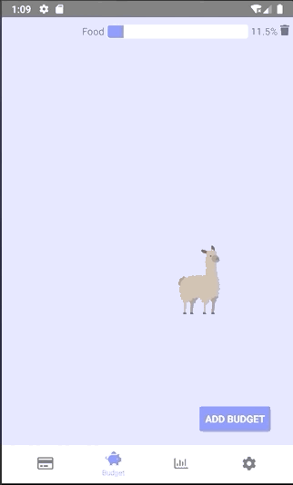
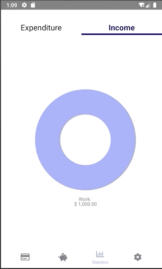
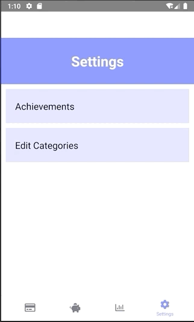
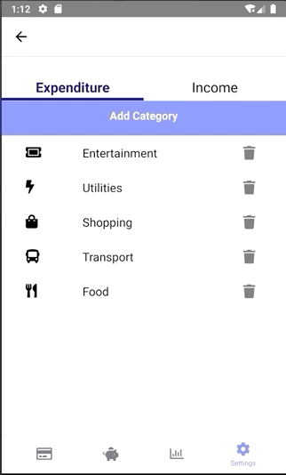

####
Alpacash is a gamified financial tracker that aims to engage its users to save more and derive excitement from managing their income and expenditure. It is a cross-platform mobile application with a clean and functional interface.

## Level of Achievement
Alpacash is a project under Orbital, an independent software development project module offered by the School of Computing. Our level of achievement is **Apollo 11**.

## Motivation
This application idea came about because we saw a trend of individuals downloading financial trackers but failing to keep up with updating their tracker. We thus wanted to develop an application that would engage its users to continuously use and open the app. In addition, we wanted Alpacash to be clean, intuitive and easy to use.

## Getting Started
These instructions will get you a copy of the project up and running on your local machine for testing purposes. 

### Prerequisites
What things you need to install and how to install them
```
react-native-cli: 2.0.1
```
```
react-native: 0.59.8
```
```
Android Studio (or working emulator of your choice)
```

### Installing
A step by step guide to get a development and testing environment running.
#### Option 1
1. Install android studio
2. Download the 'app-x86-release.apk' file
3. Open your emulator in android studio
4. Drag the .apk file into the emulator
5. Open the Alpacash app on the emulator (Note: App will not open on its own, will need to find and click the app to open it)

#### Option 2
1. Install react native and android studio
2. Clone Alpacash into your local repository
3. Open your emulator
4. Switch to the Alpacash directory
5. Run "npm install"
6. Run "react-native run-android"

## User Stories
The following are features that a user would have/ want in a financial tracker, based on a preliminary sensing when we asked our peers for their feedback/ opinions on the project.
#### As a user of the financial tracker, I want to:
1. Be able to add and delete my transactions
2. Split my transactions based on income and expenditure, as well as different categories within income and expenditure
3. Be able to customise the categories of transactions to suit my personal needs
4. Set budgets to keep my spending in check
5. View the percentage of my budget spent, and have it reset at regular intervals
6. See the statistics behind my expenditure habits to understand where my money is going into
7. Be incentivised to continue using the app to track my expenses and encourage me to save

## Unique Selling Point
The unique selling point of our financial tracker is in its gamified portion. In the market presently, there are gamified financial trackers but those trackers reward for **spending** rather than **saving**, where a certain amount of expenditure recorded by the user would give the user different items to collect, e.g. buildings. In our application, we tried to emphasise on the saving aspect of the tracker by giving alpacas based on the **percentage of budget spent**.

## Summary of Features
### Transactions
* Scroll through transactions weekly and by day
* Add transactions split by income/expenditure and categories
* Delete transactions
* Automatic balance calculation

#### 


### Budget
* Create weekly budgets (set title and categories to count into budget)
* Display progress bar based on percentage of weekly budget spent
* Delete budgets
#### 


* Earn alpacas of different levels depending on percentage of budget spent (the higher the percentage, the higher the level)
* View your alpacas and have fun dragging them around
#### 


### Statistics
View expenditure and income for the week, broken down into different categories.
#### 


### Settings - Achievements Page
View all alpacas collected and collect them all!
#### 


### Settings - Edit Categories
* Create new categories (name, icon)
* Delete unwanted categories
#### 


## Additions or Bugs Squashed from Milestone 2 to 3
* Users can now collect a variety of alpacas (earned based on how much they save weekly) and view these alpacas in the achievements page found in Settings
* Users can now create and delete their own categories
* Users can now remove budgets
* Budget and statistics are now reset weekly (was not reset previously)
* Cleaner and more cohesive interface with standardised colour scheme
* Data is now connected to Firebase to enable saving of data when user closes the application

## Problems Encountered
* Firebase authentication cannot be added to React Native application
* React Native does not currently offer a way to get the position of moving objects on the screen. We were thus unable to merge alpacas as initially intended.
* Some alpacas get dragged even when the user is tapping/ dragging outside that alpacas' frame. Presently, we are unable to find a way to fix this bug as react-native does not offer an option to contain the dragging within the width of the image.

## User Testing
The following are some of the suggestions that users have made during user testing:
* The Achievements page featuring all alpacas collected by user was implemented to motivate users to collect as many alpacas as possible. This page was a suggestion adopted from a consultation with Esther Tham, a senior consultant in Experience Design from ThoughtWorks.
* Colours on all tabs (trans, budget, etc.) have been standardised upon suggestion by users for a cleaner interface or look.
* Users found that they could type long titles for the budget that would run off the budget screen, causing the delete button to go out of screen. To resolve this, we limited the number of characters in the budget name.
* Users found that they could input non-numerical values when adding Transactions, which would interfere with the calculation of our balance. This has not been fixed but will be fixed in the future.
* Users found that the categories available in Milestone 2 were too limited for a Financial Tracker. We have since added the option for users to add or delete categories based on need in the Settings page. 

## Built With
* [React Native](https://facebook.github.io/react-native/)
* [Firebase](https://firebase.google.com/)

## Authors
* **Jolyn Tan** - A0188200M - [Github](https://github.com/jolynnn8D)
* **Valary Lim** - A0190343L - [Github](https://github.com/ValaryLim)